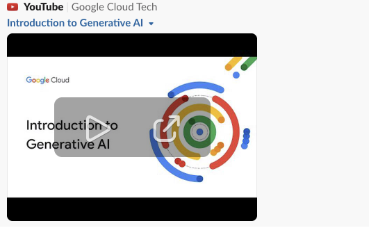
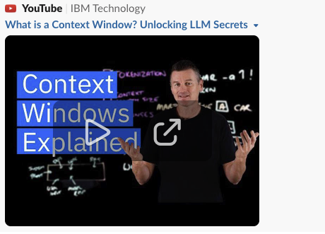
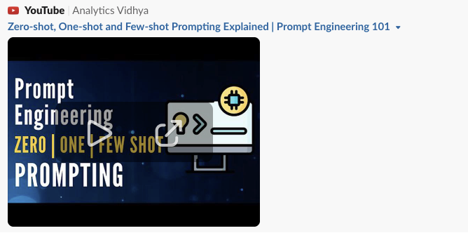

## Video: Introduction to Generative AI
#### Duration: 22 mins.

[Introduction to Generative AI](https://www.youtube.com/watch?v=G2fqAlgmoPo)
 

> [!NOTE]
> What you will learn in this video?
>
> This video gives a gentle intro to Artificial Intelligence, Machine Learning, Deep Learning and Generative AI. It expains what are Foundation Models and the types of Generative AI models.

## Video: Introduction to Context Length
#### Duration: 12 mins.

[Introduction to Context Length](https://www.youtube.com/watch?v=-QVoIxEpFkM)
 

> [!NOTE]
> What you will learn in this video?
>
> This video explains Context Length and its inner working using concepts like Self Attention in Transformer architecture.

## Video: Introduction to Prompting Techniques
#### Duration: 4 mins.

[Introduction to Prompting Techniques](https://www.youtube.com/watch?v=sW5xoicq5TY)
 

> [!NOTE]
> What you will learn in this video?
>
> This video explains Zero Shot, One Shot and Few Shot Prompting Techniques.