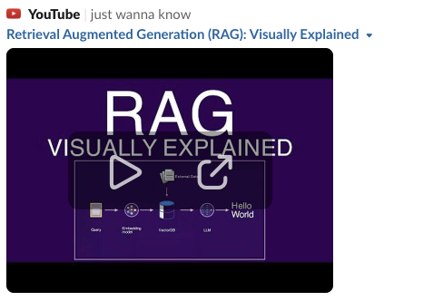

## Video: Introduction to Generative AI
#### Duration: 22 mins.

[Introduction to Generative AI](https://www.youtube.com/watch?v=G2fqAlgmoPo)
 

> [!NOTE]
> What you will learn in this video?
>
> This video gives a gentle intro to Artificial Intelligence, Machine Learning, Deep Learning and Generative AI. It expains what are Foundation Models and the types of Generative AI models.

## Video: Introduction to Context Length
#### Duration: 12 mins.

[Introduction to Context Length](https://www.youtube.com/watch?v=-QVoIxEpFkM)
 

> [!NOTE]
> What you will learn in this video?
>
> This video explains Context Length and its inner working using concepts like Self Attention in Transformer architecture.

## Video: Introduction to Prompting Techniques
#### Duration: 10 mins.

[Introduction to Prompting Techniques](https://www.youtube.com/watch?v=sZIV7em3JA8)
 

> [!NOTE]
> What you will learn in this video?
>
> This video explains Zero Shot, Few Shot and Chain of Thought Prompting Techniques.

## Video: Word and Sentence Embeddings
#### Duration: 8 mins.

[Word and Sentence Embeddings](https://www.youtube.com/watch?v=A8HEPBdKVMA)
 

> [!NOTE]
> What you will learn in this video?
>
> This video explains the concept of embeddings and how embeddings are calculated for words and sentences.

## Video: Similarity Between Sentences
#### Duration: 7 mins.

[Similarity Between Sentences](https://www.youtube.com/watch?v=B3jS_aUEicY)
 

> [!NOTE]
> What you will learn in this video?
>
> This video explains how embeddings can be used compute similarity between sentences.

## Video: Introduction to a Vector Database
#### Duration: 9 mins.

[Introduction to a Vector Database](https://www.youtube.com/watch?v=gl1r1XV0SLw)
 

> [!NOTE]
> What you will learn in this video?
>
> This video explains what is a Vector Database.

## Video: Introduction to Retrieval Augmented Generation (RAG)
#### Duration: 11 mins.

[Introduction to Retrieval Augmented Generation](https://www.youtube.com/watch?v=u47GtXwePms)
 

> [!NOTE]
> What you will learn in this video?
>
> This video explains how Retrieval Augmented Generation works.

## Video: Details of Retrieval Augmented Generation (RAG) 
#### Duration: 15 mins.

[Details of Retrieval Augmented Generation](https://www.youtube.com/watch?v=1EYVt1axmfg)
 

> [!NOTE]
> What you will learn in this video?
>
> This video explains working of Retrieval Augmented Generation works.